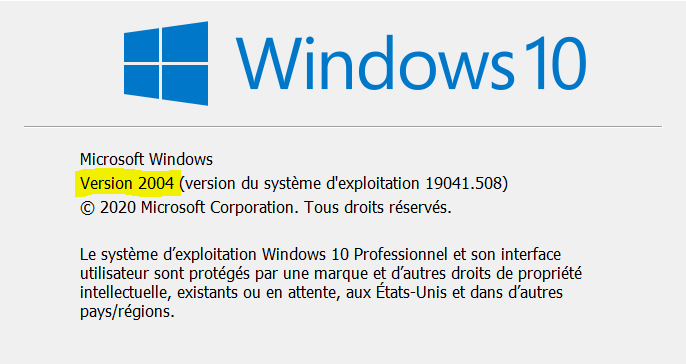
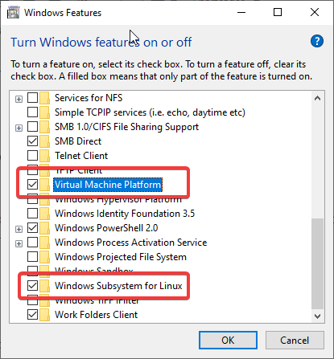
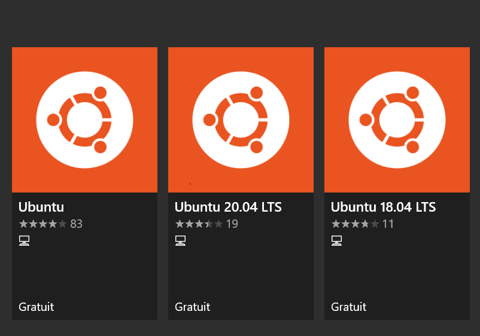

# Introduction

Not so long ago I've started using intensively Linux. I really love the power of open source softwares. Linux may be intimidating when you start using it but when you understand how it works, your computer will no more have secrets for you.  

Developping in Linux offered me the best ever experience I've had so far. I am not saying that Windows is bad but I just very comfortable using `bash` and easy is it to install any package just through a few command line with `apt` for Debian based Linux distributions.  

One of the major advantages I've found so far using Linux over Windows is about networking and the ability to easily connect and using your computer resources remotely.  

In reality today the majority of web and cloud servers are running Linux and that is not because Linux is free but because at its core Linux was designed to help computers communicate.  

When I bought my computer, like the majority of the PCs yo would buy today, it was shipped with the latest Windows 10 OS. I am really happy with that operating system for my college courses. Most of the softwares including R, Python, Stata, SAS, Gretl all work really fine on Windows and so no need to look elsewhere.  

But as I started to do web developement I've come to have little hard times with Windows. 
I remember a web application I was developping using the [R Shiny framework](https://shiny.rstudio.com/). I can preview the functionalities I added to the application through my web browser when I run the application. I wanted to make it visible to the other members of the team but the only way to do so was through the [Shiny server](https://rstudio.com/products/shiny/shiny-server/) which only work on Linux OSs. 

This leads me to install [Kubuntu]() as dual boot on another partition of my laptop. With that I could provide an IP address with a port to the rest of the team to use the application : logging in, updating the database. 

Also as the final version of the application will be served on the server of the Institute I needed to manage few details on deployment, which I finally did using Linux.  

## Goal of the tutorial 

I am really excited to present this tutorial because the content I find is really mind blowing and it offers a serious compromise : combining both the power of Windows and Linux at the same on the same computer. 

Here's the outline of what I will discuss :

- How to install the Windows Subsystem for Linux (WSL 2) and enable it   
- How to install a Linux distribution (Ubuntu for this tutorial, but you can install any distribution you're familiar with)   
- How to install R and Rstudio Server on that Linux distribution  
- How to use the Rstudio Server through your Windows running browser  
- How to access Rstudio server on any computer (or tablets, smartphones) connected to your Local Area Network (LAN)   


# Install WSL 2 and configure it on Windows 10   

## Prerequisites  

The only prerequisites of this part is to have a Windows 10 laptop running at least the 2004 version. **You don't need to have Windows 10 Professional**.  
You can check that by typing `winver` in the Start menu.  

   

If you don't have the 2004 version you'll need to upgrade your Windows laptop because the WSL 2 only work on it.  

You can do so with Windows Update : fetch the latest updates and upgrade your computer before you continue.  

From now I will assume that you have the Windows 10 version 2004.  

The WSL 2 is not by default activated on your computer, you need to activate it. 

There are two ways of doing so : the command line way and the GUI way.  


## Activate WSL 2 and Virtual Machine Platform using Powershell

For the command line approach you need to Open PowerShell as an administrator and type the following commands : 


```{}
# Enable the WSL2 without reboot 
dism.exe /online /enable-feature /featurename:Microsoft-Windows-Subsystem-Linux /all /norestart 

# Enable the Virtual Machine Platform 
dism.exe /online /enable-feature /featurename:VirtualMachinePlatform /all /norestart

```

## Activate WSL 2 and the Virtual Platform via the Graphical User Interface  

Alternatively to the Powershell approach where you execute the code above, you can activate both WSL 2 and the Virtual Platform using the Graphical User Interface provided by your Windows OS.  

Open the start menu and type *"turn on windows features ...*. You'll be redirected to a screen similar to this : 


Select both Windows Subsystem for Linux & Virtual Machine Platform and click [OK] to validate.  
It may require you to reboot your computer. Make sure you save all your opening works before rebooting your computer.   

## Making WSL 2 default  

Since WSL 2 is new, it may be the default on your computer. In fact you can still use WSL 1 alongside WSL 2. But is is recommanded to switch to WSL 2 for the lots of benefits enumerated on the [Comparing WSL 1 & WSL 2](https://docs.microsoft.com/en-us/windows/wsl/compare-versions) page.  

To do so you just need to open Powershell and execute the following commands : 

```{}
wsl --set-default-version 2
```

Any ditributions you will install are going to use WSL 2 by default.  

# Installing Ubuntu   

You can install any distribution you like, but for this tutorial I'll stick with the latest Ubuntu 20.04.  

R and R Studio server exist for all major distributions, even if your distribution doesn't have a package manager to install R and R Studio Server you can build them from source (I have never done it before but it exists).  


## Download Ubuntu from the Windows Store   

 

This is quite straightforward : Windows Store provides a sample of major Linux distributions, some custom distributions may not be free for download but Ubuntu is free. Just click on *Install*. It will download the OS. When the installation finishes it will ask you to provide valid UNIX username and password. That's all you need. 


### Case when you previously have a Linux distribution running WSL 1  

Let's suppose this is not the first time you use WSL and you have a functional distributions you installed with WSL 1. it is possible to convert that distribution to WSL 2 using that commands : 

**Close all the instances of that distribution before you proceed.**   

```{}
# First list the names of the installed distributions 
wsl --list 

# Pick the name of the distribution and execute 
wsl --set-version <distribution name> 2
```

Replace `<distribution name>` with the name of your distribution. 


# Installing R and Rstudio Server  

From now you should have a Linux distribution running on WSL 2 on your Windows 10 laptop.  

I will install the latest version of R and Rstudio Server for Ubuntu 20.04.  


